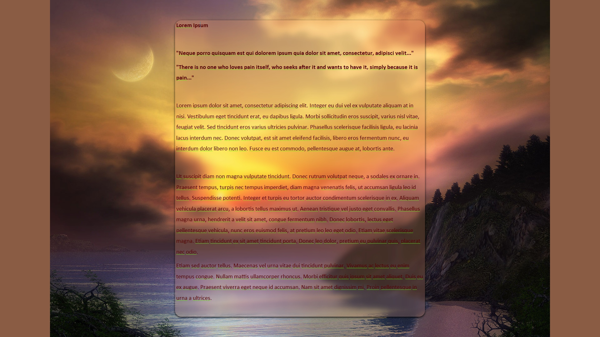

# FocusWriter-Theme_STK_GildedDusk

A custom theme for [FocusWriter](https://gottcode.org/focuswriter/), designed to create a distraction-free writing environment.

**Author:** intothisshadow
**GitHub:** https://github.com/intothisshadow/
**Website:** https://www.so-obsessed.com

## 📸 Preview

> A glimpse of your new distraction-free environment.

---
## ✨ Features

* **Stock**

## 🚀 Installation
### The Easy Way (Import)

1. Download the **`FocusWriter-Theme_STK_GildedDusk.fwtz`** file from this repository.
2. Open **FocusWriter**.
3. Move your mouse to the top of the screen to reveal the menu.
4. Go to **Settings > Themes** (or click the Palette Icon).
5. Click the **Import** button at the bottom of the window.
6. Select the **`FocusWriter-Theme_STK_GildedDusk.fwtz`** file and click **Open**.
7. Select the theme from your list and click **Close**.

### The Manual Way

If you prefer to move files manually, place the **`.fwtz`** file in the following directory:

* **Windows:** `%LOCALAPPDATA%\GottCode\FocusWriter\Themes`
* **macOS:** `~/Library/Application Support/GottCode/FocusWriter/Themes`
* **Linux:** `~/.local/share/GottCode/FocusWriter/Themes`

## 🛠️ Customization

If the margins or font sizes aren't quite right for your screen resolution:

1. Open the **Themes** window.
2. Select **FocusWriter-Theme_STK_GildedDusk** and click **Edit**.
3. Adjust the **Text** (font/size) or **Margins** tabs to your liking.

